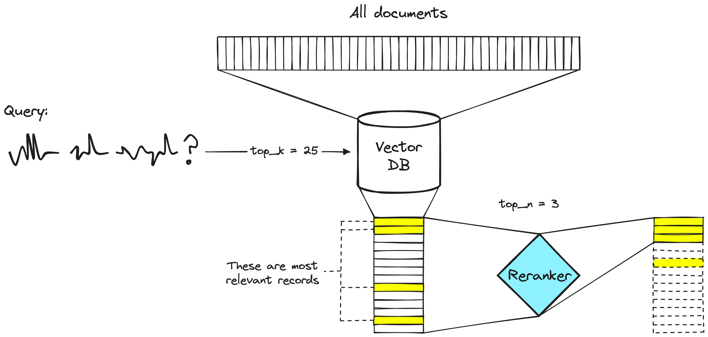

# Reranking

[Image: Rerankers and Two-Stage Retrieval](https://www.pinecone.io/learn/series/rag/rerankers/)

As semantic similarity becomes a core technique for delivering context to LLM-based applications, the challenge of **finding truly relevant information** grows more important. Most modern systems use **embedding models** to convert unstructured text into vector representations, storing these in a vector database for fast similarity-based retrieval.

While this first-step retrieval process is efficient and scalable, **the top results may not always be the best-aligned passages for a given query.** They might be “near matches,” but not the most contextually relevant.
This is where **reranking** comes in: a second-stage process that reorders the initially retrieved set to better match the true information need.

Reranking uses a dedicated model—typically a **cross-encoder** or a **late interaction model** to directly compare each candidate passage with the query, assigning a fine-grained relevance score. By re-evaluating these candidate passages, rerankers help surface  the most useful, specific, and accurate results to the top.

In this notebook, we’ll explore the most popular reranking approaches in modern RAG pipelines, with an intuitive look at how these models work and how they improve retrieval quality.

https://www.youtube.com/watch?v=7ZU85v4Kt-Y
